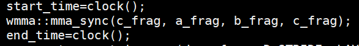
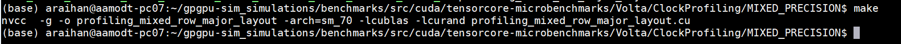
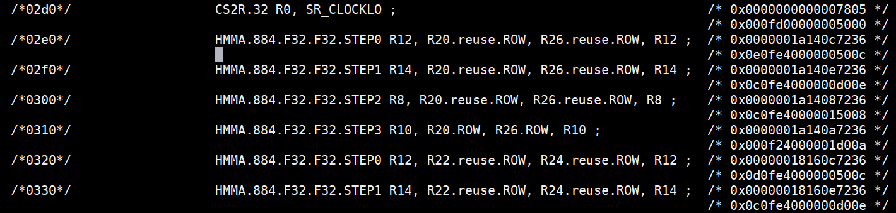
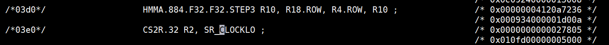
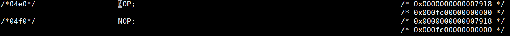
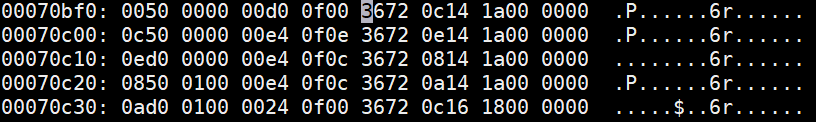
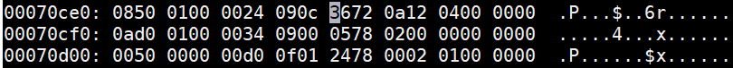
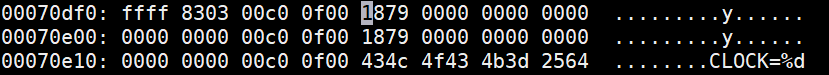

If you use the code in this directory in your work, please cite:

Md Aamir Raihan, Negar Goli and Tor M. Aamodt, "**Modeling Deep Learning Accelerator Enabled GPUs**",
In Proc. IEEE International Symposium on Performance Analysis of Systems and Software (ISPASS),
Madison, Wisconsin, March 24-26, 2019.

# Clock Profiling

## Code

Since each wmma::mma API will be broken into 16 HMMA instructions for Volta Tensor Core and we want to profile cumulative clock cycle for the nth HMMA instructions. So, our objective is basically to move the clock instruction after the nth HMMA and make the rest of HMMA instruction to NOP instruction.

**Compile the code**

**Dump the SASS code**

Command: **cuobjdump -sass profiling_mixed_row_major_layout > sass**

Open the dumped sass and search for HMMA, CLOCK and NOP instruction:

**HMMA**

**CLOCK**

**NOP**

**Right column represent the hex code of the instruction**.  Now let’s find the address where these instructions are present in the binary.

## Open the binary in vim in hex mode
**Command**:

	vi profiling_mixed_row_major_layout
	:%! xxd (enter the following command in command mode)

**Search HMMA instruction by searching 3672 ( due to endianness)**

**Search CLOCK instruction by searching 0578 ( due to endianness)**

**Search NOP instruction by searching 1879 ( due to endianness)**

**Left column represents the address where the instruction is present in the binary.**

Now we have to overwrite the 2nd HMMA instruction at the address 0x70c08 with the clock instruction 0x0578 0200 0000 0000  0050 0000 00d0 0f01

## Use radare2 to edit the binary
**Command**:

	radare2 -Aw profiling_mixed_row_major_layout 

**Overwrite the 2nd HMMA instruction with Clock instruction**:

	s 0x70c08 (move to address)
	wx 0578 0200 0000 0000  0050 0000 00d0 0f01 (write) 
	px (cross verify)

**Overwrite the Clock instruction at address 0x70ce8 with NOP instruction 0x1879 0000 0000 0000 0000 0000 00c0 0f00**

	s 0x70ce8 (move to address)
	wx 1879 0000 0000 0000  0000 0000 00c0 0f00 (write) 
	px (cross verify)

Similarly, make the rest of the HMMA instruction NOP.

Using this binary one can find the clock cycles needed by 1st HMMA instruction. Similarly create a separate binary to find the cumulative clock cycle of nth HMMA instruction by moving the clock instruction after nth HMMA instruction and making rest of the HMMA instruction NOP.

For the exhaustive profiling create a separate binaries for the FP16 and MIXED precision mode in Volta Tensor Cores and for Turing Tensor Cores separate binaries were created for the following mode

| MODE           | TILE SIZE  | MATRIX A PRECISION | MATRIX B PRECISION | MATRIX C PRECISION |
|----------------|------------|--------------------|--------------------|--------------------|
| 16x16x16HHF_RR | (16,16,16) | FP16               | FP16               | FP32               |
| 16x16x16HHH_RR | (16,16,16) | FP16               | FP16               | FP32               |
| 16x16x16SSI_RR | (16,16,16) | Signed 8 Bit       | Signed 8 Bit       | INT                |
| 16x16x16UUI_RR | (16,16,16) | Unsigned 8 Bit     | Unsigned 8 Bit     | INT                |
| 32x8x16HHF_RR  | (32,8,16)  | FP16               | FP16               | FP32               |
| 32x8x16HHH_RR  | (32,8,16)  | FP16               | FP16               | FP32               |
| 32x8x16SSI_RR  | (32,8,16)  | Signed 8 Bit       | Signed 8 Bit       | INT                |
| 32x8x16UUI_RR  | (32,8,16)  | Unsigned 8 Bit     | Unsigned 8 Bit     | INT                |
| 8x32x16HHF_RR  | (8,32,16)  | FP16               | FP16               | FP32               |
| 8x32x16HHH_RR  | (8,32,16)  | FP16               | FP16               | FP32               |
| 8x32x16SSI_RR  | (8,32,16)  | Signed 8 Bit       | Signed 8 Bit       | INT                |
| 8x32_16UUI_RR  | (8,32,16)  | Unsigned 8 Bit     | Unsigned 8 Bit     | INT                |

# SASS Profiling

For SASS profiling follow the similar procedure but instead of replacing the HMMA instruction with NOP, replace all the HMMA instruction except the one whose execution we want to find with NOP. By executing the modified binary one can decode the corresponding HMMA instruction. Analyzing the output is done manually.

